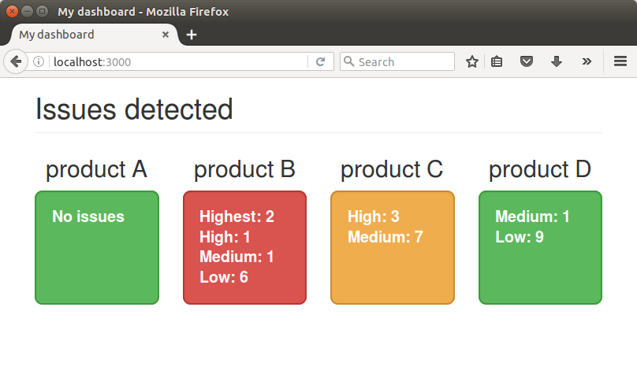

# meteor-monitor

Meteor-monitor is a sample application to show how to pick data from external apis to generate a dashboard.

Let's say we want to monitor some jira issues based on some filters, we can get something like the following picture :

Meteor-monitor is based on https://www.meteor.com/ (Many thanks Captain Obvious !)

## Run metor-monitor

To run the application, you need first to install meteor : https://www.meteor.com/install

    git clone
    cd meteor-monitor
    meteor

and open your browser to http://localhost:3000/

## First steps

In client/main.js, define the filters you want to monitor :

    Template.body.helpers({
      jiraQueryMonitors: [
        { id: 'product1', title: 'product A', jql: 'priority = Medium' },
        { id: 'product2', title: 'product B', jql: '' },
        { id: 'product3', title: 'product C', jql: 'priority in (High, Medium)' },
        { id: 'product4', title: 'product D', jql: 'priority in (Medium, Low)' }
      ],
    });

In client/main.html, define the main template :

    <head>
      <title>meteor-monitor</title>
    </head>
    <body>
      

        <h1 class="page-header">Issues detected</h1>
        

          {{#each jiraQueryMonitors}}
            {{> jiraQueryMonitor}}
          {{/each}}
        

      

    </body>

## To do

- handdle jira authentification
- implement jenkins connector

## Resources
https://www.meteor.com/tutorials/blaze/creating-an-app
https://www.discovermeteor.com/blog/a-guide-to-meteor-templates-data-contexts/
https://dzone.com/articles/integrating-external-apis-your
https://docs.atlassian.com/jira/REST/cloud/
