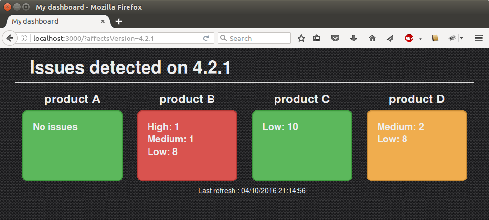

# meteor-dashboard

Meteor-dashboard is a sample application to show how to pick data from external apis to generate a dashboard.

The code base generates a dashboard to monitor the number of jira issues opened on some specific features (or products).

Meteor-dashboard is based on https://www.meteor.com/ (No link with the 1979 movie).

## Run metor-monitor

To run the application, you need first to install meteor : https://www.meteor.com/install

    git clone https://github.com/sboursault/meteor-dashboard.git
    cd meteor-dashboard
    meteor

and open your browser to http://localhost:3000/

## First steps

In `client/main.js`, define the url for your jira instance and the filters you want to monitor:

    const jiraUrl = 'https://jira.atlassian.com';
    
    const jiraQueryMonitorArray = [
      { id: 'product1', title: 'product A', jql: 'assignee="copain"' },
      { id: 'product2', title: 'product B', jql: 'priority in (Low)' },
      { id: 'product3', title: 'product C', jql: 'priority in (High, Medium)' },
      { id: 'product4', title: 'product D', jql: 'priority in (Medium, Low)' }
    ];

In `client/main.html`, define the main template:

    <h1 class="page-header">Issues detected {{ affectsVersion }}</h1>
    

      {{#each jiraQueryMonitors }}
        

          <h2>{{{ title }}}</h2>
          

          {{ runMonitor }}
        

      {{/each}}
    

If necessary, you can use a specific account to connect to the jira server. Change the http options `imports/jira-query-monitor/connector.js`:

    const httpOptions = {/*auth: '<user>:<passwd>'*/};

## To do

- implement jenkins connector

## Resources

- https://www.meteor.com/tutorials/blaze/creating-an-app

- https://www.discovermeteor.com/blog/a-guide-to-meteor-templates-data-contexts/

- https://dzone.com/articles/integrating-external-apis-your

- https://docs.atlassian.com/jira/REST/cloud/
